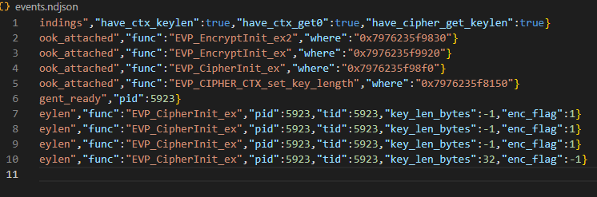

# DynamicAnalysis-cpp

OpenSSL을 사용하는 C++ 바이너리의 암호화 동작을 Frida를 통해 동적으로 분석하는 도구입니다.

## 기능

- 사용하는 암호화 함수를 정적 분석을 통해서 알고 있다는 전제하에 동적 분석 수행, 키 길이를 동적 분석을 통해 얻어냄 (byte단위)



- OpenSSL 암호화 함수 호출 추적 (`EVP_EncryptInit_ex`, `EVP_CipherInit_ex` 등)
- 키 길이, 암호화 모드, PID/TID 정보 수집
- NDJSON 형태로 이벤트 로깅
- 구/신 Frida 버전 호환성 지원

## 빌드

```bash
make
```

## 사용법

### 기본 실행
```bash
./bin/runner --target /path/to/target/binary \
             --agent agent.js \
             --out events.ndjson \
             -- [target_args...]
```

### 샘플 테스트
```bash
# 1. 샘플 빌드
cd samples/aes_256_cbc
make
cd ../..

# 2. 분석 실행
make run TARGET=./samples/aes_256_cbc/aes_256_cbc
```

## 출력 예시

[`events.ndjson`](events.ndjson)에 다음과 같은 형태로 기록됩니다:

```json
{"ts":"2025-09-19T13:39:33.386Z","event":"bindings","have_ctx_keylen":true,"have_ctx_get0":true,"have_cipher_get_keylen":true}
{"ts":"2025-09-19T13:39:33.388Z","event":"hook_attached","func":"EVP_EncryptInit_ex","where":"0x7976235f9920"}
{"ts":"2025-09-19T13:39:33.392Z","event":"keylen","func":"EVP_CipherInit_ex","pid":5923,"tid":5923,"key_len_bytes":32,"enc_flag":-1}
```

## 요구사항

- **Frida**: `pip install frida-tools`
- **OpenSSL 개발 라이브러리**: `apt install libssl-dev` (Ubuntu)
- **C++17 지원 컴파일러**

## 프로젝트 구조

```
├── runner.cpp              # 메인 실행기
├── agent.js                # Frida 에이전트 스크립트
├── samples/aes_256_cbc/    # 테스트용 AES 샘플
├── bin/runner              # 빌드된 실행파일
└── events.ndjson           # 분석 결과 로그
```

## 의존성 확인

```bash
make deps-check
```